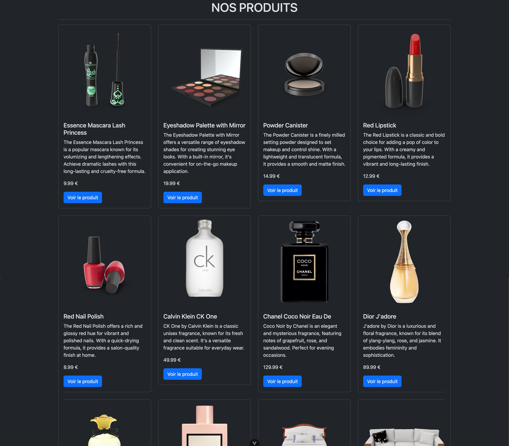
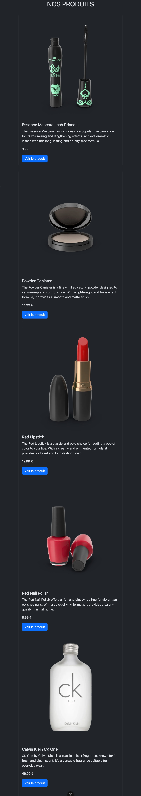
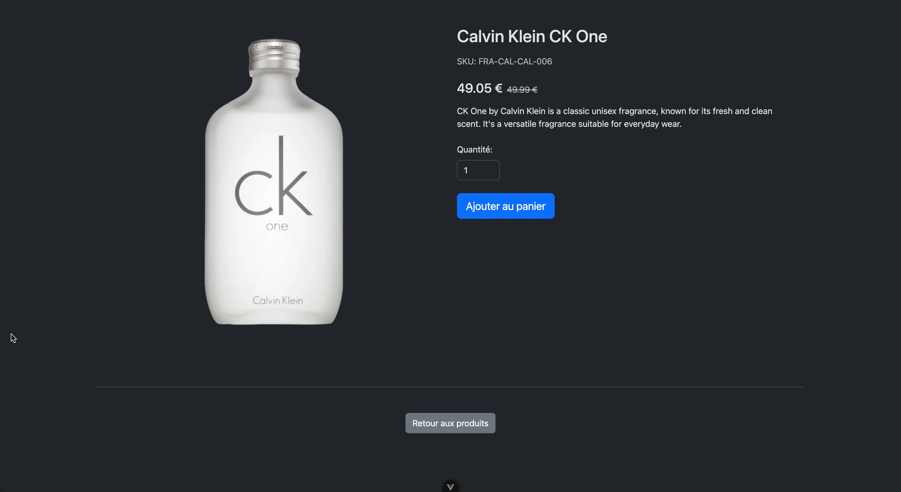
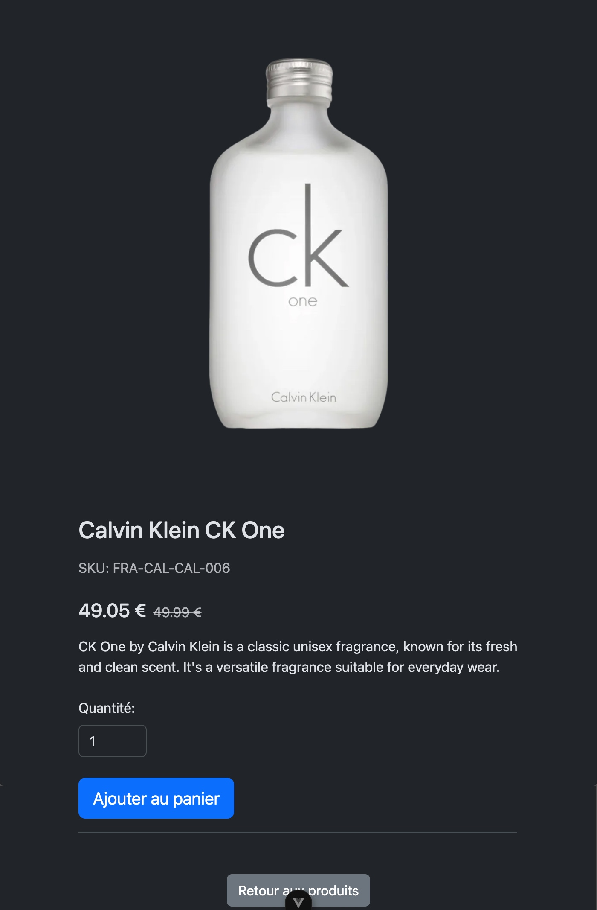

### Exercice : Application de Gestion de Produits avec Vue 3, Vue Router, et Bootstrap

#### Objectif
Créer une application simple de gestion de produits où vous pouvez afficher une liste de produits chargés à partir d'une API et voir les détails d'un produit en passant son identifiant dans l'URL. Utilisez Vue 3 avec la Composition API, Vue Router pour la gestion des routes, et Bootstrap pour le style, en mettant en œuvre une grille et des cartes pour afficher les produits.

#### Instructions

1. **Configuration du Projet**
   - Initialisez un nouveau projet Vue 3 en utilisant Vue CLI ou Vite.
   - Installez les dépendances nécessaires (Vue Router et Bootstrap) :

2. **Structure du Projet**
   - Créez les composants suivants :
     - `ProductListView.vue` : Affiche une liste de produits.
     - `ProductDetailView.vue` : Affiche les détails d'un produit spécifique.
     - `App.vue` : Le composant racine qui inclut le routeur.

3. **Configuration du Routeur**
   - Configurez Vue Router pour gérer les routes suivantes :
     - `/` : Affiche la liste des produits.
     - `/product/:id` : Affiche les détails d'un produit spécifique.
   - Consultez la [documentation officielle de Vue Router](https://router.vuejs.org/) pour plus de détails.

4. **Passage des Paramètres dans l'URL**
   - Utilisez les paramètres de route pour passer l'identifiant du produit à `ProductDetailView.vue`.

5. **Chargement des Produits à partir d'une API**
   - Utilisez Fetch pour charger les produits à partir de l'API [DummyJSON](https://dummyjson.com/products).
   - Chargez les produits grâce au hook `onMounted`. Consultez la [documentation officielle de Vue 3 en français](https://vuejs.org/guide/introduction.html) pour plus de détails sur les hooks de cycle de vie.

6. **Utilisation de Bootstrap**
   - Intégrez Bootstrap dans votre projet pour styliser les composants.
   - Utilisez la grille de Bootstrap et un système de cartes pour afficher les produits.
   - Consultez la [documentation officielle de Bootstrap](https://getbootstrap.com/docs/5.3/getting-started/introduction/) pour savoir comment utiliser la grille et les cartes.

7. **Chargement des Produits**
   - Dans `ProductListView.vue`, utilisez Fetch pour charger les produits à partir de l'API DummyJSON dans le hook `onMounted`.
   - Affichez la liste des produits avec des liens vers leurs pages de détails en utilisant la grille de Bootstrap et des cartes.

8. **Affichage des Détails du Produit**
   - Dans `ProductDetailView.vue`, récupérez l'identifiant du produit à partir de l'URL et utilisez Fetch pour charger les détails du produit correspondant.
   - Affichez les détails du produit en utilisant des cartes Bootstrap.

9. **Stylisation avec Bootstrap**
   - Utilisez les classes Bootstrap pour styliser vos composants et rendre l'application visuellement attrayante.
   - Assurez-vous d'utiliser la grille de Bootstrap pour organiser les produits et les cartes pour afficher les informations de manière claire et concise.

10. **Ajouter un loader**
      - Ajoutez un composant BootstrapLoader pour indiquer que les produits sont en cours de chargement.
      - Utiliser une variable reactive isLoading pour indiquer si les produits sont en cours de chargement.
      - Afficher le loader tant que isLoading est vrai.
      - Masquer le loader lorsque isLoading est faux.

### Example de rendu

#### Liste des produits

#### Liste des produits (mobile)

#### Détails d'un produit

#### Détails d'un produit (mobile)  
